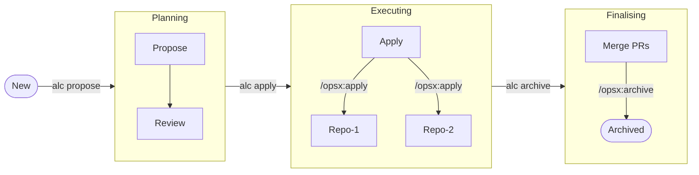

# Augentic Lifecycle (alc)

Multi-repo orchestration CLI for spec-driven development. Centralised planning, distributed execution.

## Quick Start

```bash
cargo install --path .
```

Create a `registry.toml` at the root of your hub repo:

```toml
[[services]]
id = "my-service"
repo = "git@github.com:org/my-service.git"
project_dir = "."
crate = "my-service"
domain = "core"
capabilities = ["ingest", "transform"]
```

Then run the workflow:

```bash
alc propose my-change --description "Add priority field to ingest pipeline"
# Review the generated artefacts in openspec/changes/my-change/

alc apply my-change
# Distributes specs, opens draft PRs, and invokes the AI agent in each target repo

alc archive my-change
# Syncs PR state from GitHub; auto-archives when all PRs are merged
```

Every command supports `--dry-run` to preview without side effects.

## Workflow



### Planning

Generate planning artefacts for a new change. This phase is centralised and determines which repos will be impacted by the change.

```bash
alc propose <change> --description <text> [--dry-run]
```

Generate planning artefacts for a new cross-repo change. The agent reads `registry.toml` and current specs from target repos, then produces:

- `proposal.md` — why and what, per-affected-service summary
- `specs/<service>/<capability>/spec.md` — delta specs (ADDED/MODIFIED/REMOVED)
- `design.md` — technical design per service
- `tasks.md` — implementation tasks grouped by repo
- `pipeline.toml` — execution plan with targets and dependencies

All artefacts are written to `openspec/changes/<change>/`.

### Executing

On `execution of the `alc apply` command, the engine will generate OPSX specifications for each target repo and distribute them to the target repos.

The OPSX specs are distributed to the target repos and the AI agent is invoked in each target repo to implement the change. Targets are processed in dependency order (topological sort). Use `--target` to apply a single target.

```bash
alc apply <change> [--target <id>] [--dry-run] [--continue-on-failure]
```

For each repo group in `pipeline.toml`:

1. Shallow-clones the repo
2. Creates branch `alc/<change>` (or the branch specified in pipeline.toml)
3. Copies delta specs, upstream context (design.md, tasks.md), and a brief.toml
4. Commits, pushes, and opens a draft PR
5. Invokes the AI agent to implement the change
6. Commits and pushes the agent's changes

Targets already at `distributed` skip straight to agent invocation. Targets at `implemented` or later are skipped entirely. Use `--continue-on-failure` to keep processing independent groups when one fails.

#### Status updates

Print the pipeline status table showing each target's current state and PR URL.

```bash
alc status <change>
```

States are: `pending` → `distributed` → `applying` → `implemented` → `reviewing` → `merged`. A target can also be `failed`.

### Finalising

When all repos have had their PRs merged (`merged` state), the change is automatically archived to `openspec/changes/archive/YYYY-MM-DD-<change>/`.

```bash
alc archive <change> [--mark-ready]
```

Synchronize PR state from GitHub into `status.toml`. Fetches each target's PR via the GitHub API. Transitions:

- PR merged → state becomes `merged`
- PR open + not draft + target is `implemented` → state becomes `reviewing`
- PR closed → state becomes `failed`

With `--mark-ready`, draft PRs for `implemented` targets are promoted to ready for review via the GitHub GraphQL API.

## Auxillary Commands

### `alc init`

Initialise a new hub workspace in the current directory: creates `registry.toml`, `openspec/changes/`, and `openspec/specs/`.

### `alc validate <change>`

Validate pipeline, registry, and status consistency for a change. Exits with an error if any referenced targets are missing from the registry or specs are absent.

### `alc list`

List all existing changes in the hub, showing whether each has a pipeline and/or status file.

### `alc registry list`

List all services in `registry.toml`.

### `alc registry query --domain <name>` / `--cap <name>`

Query services by domain or capability.

## Configuration Files

### `registry.toml`

The service catalog. Lives at the hub repo root. Each entry maps a service to its repo, crate, domain, and capabilities.

```toml
[[services]]
id = "r9k-connector"                                    # stable identifier
repo = "git@github.com:wasm-replatform/train.git"       # git clone URL
project_dir = "."                                        # crate location within repo
crate = "r9k-connector"                                  # Rust crate name
domain = "train"                                         # domain grouping
capabilities = ["r9k-xml-ingest"]                        # what the service does
```

Multiple services can share a repo. During apply, services sharing a repo are grouped into one branch and one PR.

### `pipeline.toml`

Generated by `propose`, lives in the change folder. Defines which targets are affected and their execution order.

```toml
change = "r9k-http"

[[targets]]
id = "r9k-connector"
specs = ["r9k-connector/r9k-xml-ingest"]

[[targets]]
id = "r9k-adapter"
specs = ["r9k-adapter/r9k-xml-to-smartrak-gtfs"]
depends_on = ["r9k-connector"]                           # inline dependency

[[dependencies]]                                         # rich dependency metadata
from = "r9k-connector"
to = "r9k-adapter"
type = "event-schema"
contract = "domains/train/shared-types.md#R9kEvent"

stop_on_dependency_failure = true
```

Target fields `repo`, `crate`, `project_dir`, and `branch` are optional overrides — if omitted, values are resolved from `registry.toml`.

### `status.toml`

Auto-managed state for each target in a change. Created on first use by `apply` or `status`. Updated by `apply` and `archive`.

## Environment Variables


| Variable                 | Default  | Description                                                          |
| ------------------------ | -------- | -------------------------------------------------------------------- |
| `GITHUB_TOKEN`           | —        | GitHub personal access token for PR creation and sync (required for `apply`, `archive`). |
| `ALC_AGENT_BACKEND`      | `claude` | Agent backend. Set to `dry-run` to print commands without executing. |
| `ALC_AGENT_TIMEOUT_SECS` | `600`    | Timeout in seconds for agent invocation.                             |
| `RUST_LOG`               | `info`   | Log level filter (standard `tracing` env filter syntax).             |


## Prerequisites

- Rust 1.93+ (edition 2024)
- `git` on PATH
- `GITHUB_TOKEN` env var — for PR creation and sync via the GitHub API
- `claude` CLI — for agent invocation (or set `ALC_AGENT_BACKEND=dry-run`)

## Development

```bash
cargo test            # run all tests
cargo build           # build debug binary
cargo run -- --help   # run directly

# Useful during development
ALC_AGENT_BACKEND=dry-run cargo run -- propose test --description "test change"
```

### Project Structure

```text
src/
├── main.rs          — entry point, command dispatch
├── cli.rs           — clap CLI definition
├── session.rs       — Session: runtime context (workspace, engine, concurrency, GitHub client)
├── context.rs       — ChangeContext: per-change state (pipeline, registry, status)
├── engine/
│   ├── mod.rs       — shared types (UpstreamPaths, DistributeContext)
│   └── opsx.rs      — OPSX engine: directory layout, prompts, distribution
├── registry.rs      — service registry (registry.toml)
├── pipeline/
│   ├── mod.rs       — Pipeline, Target, Dependency types and validation
│   ├── graph.rs     — topological sort, dependency levels
│   └── grouping.rs  — group targets by repo
├── status.rs        — target state machine (status.toml)
├── git.rs           — git operations via libgit2
├── github.rs        — GitHub API operations via octocrab
├── agent.rs         — AI agent invocation (claude CLI or dry-run)
├── propose.rs       — centralised planning command
├── apply.rs         — distribute specs, open PRs, invoke agent per target
├── archive.rs       — sync PR state from GitHub, auto-archive when done
├── brief.rs         — change brief generation
├── output.rs        — display helpers (status tables, dry-run banners)
├── util.rs          — TempDir, load_toml helper
└── workspace.rs     — workspace root discovery
```

### Engine Abstraction

`OpsxEngine` is a concrete struct that encapsulates all OpenSpec-specific logic: directory conventions, prompt templates, required artefacts, and file distribution. The rest of the codebase (registry, pipeline, status, git, agent) is engine-agnostic.

When a second engine is needed, extract a trait from `OpsxEngine`'s public API and thread it through `Session`.

### Running Tests

```bash
cargo test
```

Tests cover pipeline validation, topological sort, cycle detection, status state transitions, registry queries, and brief generation.

## License

MIT OR Apache-2.0